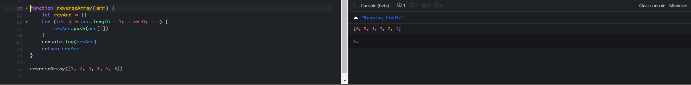

# Array-Reverse

the challenge is to write a function that will accept an array and return the reverse of it.

## Whiteboard Process


## Approach & Efficiency

I tried two approaches, first one using for loop and the second using recursive function, both gave the same result, both has the same BigO = O(n) where n is the array length

## Solution

``` JavaScript

function reverseArray(arr) {
    let revArr = []
    for (let i = arr.length - 1; i >= 0; i--) {
        revArr.push(arr[i])
    }
    return revArr
}

function recursiveArrayReversal(arr, arr2 = []) {
    if (arr.length === 0) {
        return arr2
    }
    arr2.push(arr.pop())
    return recursiveArrayReversal(arr, arr2)
}

```



### To run tests on code, navigate to the directory of the challenge and in your terminal type `npm test`
