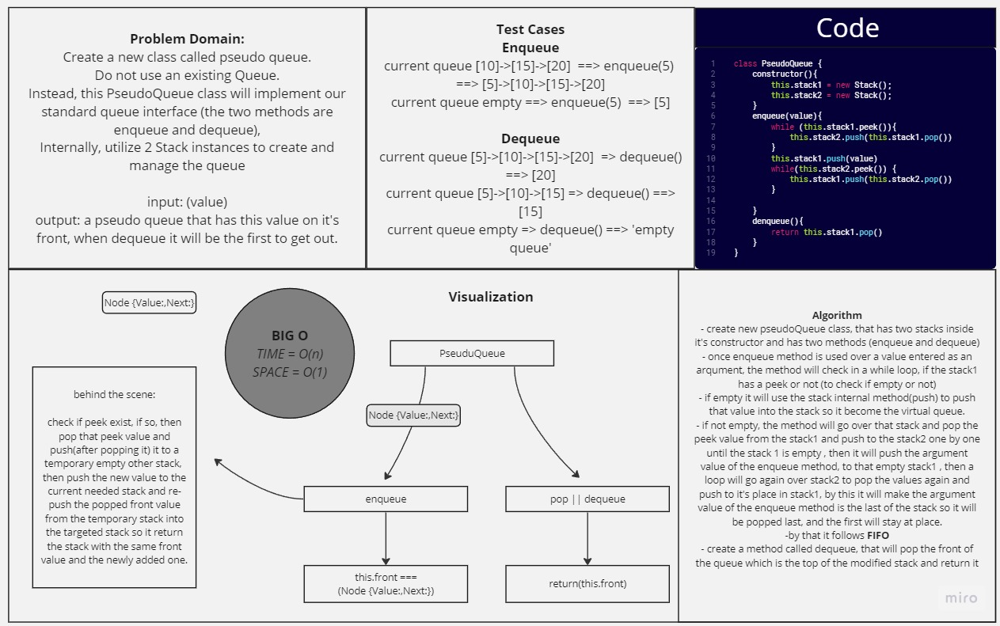

# Pseudo Queue

*Create a new class called pseudo queue.
Do not use an existing Queue.Instead, this PseudoQueue class will implement our standard queue interface (the two methods are enqueue and dequeue),Internally, utilize 2 Stack instances to create and manage the queue.*

## Whiteboard Process



## Solution

``` javascript
'use strict'
class PseudoQueue {
    constructor(){
        this.stack1 = new Stack();
        this.stack2 = new Stack();
    }

    enqueue(value){
        while (this.stack1.peek()){
            this.stack2.push(this.stack1.pop())
        }
        this.stack1.push(value)
        while(this.stack2.peek()) {
            this.stack1.push(this.stack2.pop())
        }

    }
    denqueue(){
        return this.stack1.pop()
    }
}

```

## For Tests

Navigate to the stack-queue-pseudo.js and change the testing values then in your terminal type `node stack-queue-pseudo.js` to see the result.
