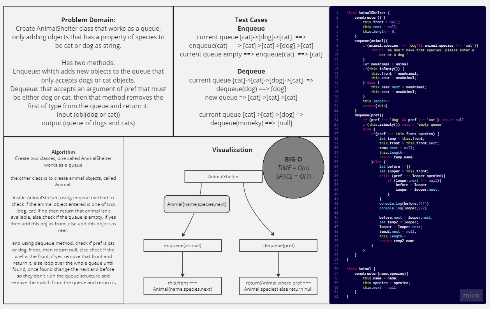

# AnimalShelter

*Create AnimalShelter class that works as a queue, only adding objects that has a property of species to be cat or dog as string.
Has two methods:
Enqueue: which adds new objects to the queue that only accepts dogs or cat objects.
Dequeue: that accepts an argument of pref that must be either dog or cat, then that method removes the first of type from the queue and return it.
input (obj(dog or cat))
output (queue of dogs and cats)*

## Whiteboard Process



## Solution

``` javascript
'use strict'
class AnimalShelter {
    constructor() {
        this.front = null;
        this.rear = null;
        this.length = 0;
    }

    isEmpty(){
        if(this.front === null) return true;
        else return false 
    }

    peek() {
        if(this.isEmpty()) return 'Queue is Empty'
        else return this.front.name;
    }

    enqueue(animal){
        if(animal.species !== 'dog'&& animal.species !== 'cat'){
            return `we don't have that species, please enter a cat or a dog.`
        }
        let newAnimal = animal
        if(this.isEmpty()) {
            this.front = newAnimal;
            this.rear = newAnimal;
        } else {
            this.rear.next = newAnimal;
            this.rear = newAnimal;
        }
        this.length++
        return(this)
    }
    dequeue(pref){
        if (pref !== 'dog' && pref !== 'cat') return null
        if(this.isEmpty()) return 'empty queue'
        else {
            if(pref === this.front.species) {
                let temp = this.front;
                this.front = this.front.next;
                temp.next = null;
                this.length--
                return temp.name
            }else {
                let before = {}
                let looper = this.front;
                while (pref !== looper.species){
                    if (looper.next !== null){
                        before = looper
                        looper = looper.next;
                    }
                }
                console.log(before,1111)
                console.log(looper,222)

                before.next = looper.next;
                let temp2 = looper;
                looper = looper.next;
                temp2.next = null;
                this.length--
                return temp2.name
            }
        }
    }
}

class Animal {
    constructor(name,species){
        this.name = name;
        this.species = species;
        this.next = null
    }
}


```

## For Tests

Navigate to the stack-queue-pseudo directory and run `npm test -- stack-queue-pseudo.test.js` .
