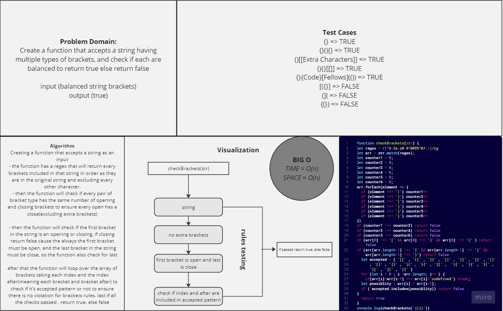

# Balanced Brackets

*Create a function that accepts a string having multiple types of brackets, and check if each are balanced to return true else return false
input (balanced string brackets)
output (true)*

## Contribution

In a team of two, we worked:

***Rama Almomani*** contributed to the solution by figuring out the looping idea to count the brackets number and exclude non - balanced ones.

***Hasan Tummalei*** contributed by figuring out the acceptable patterns and checking if our string matches it.

## Whiteboard Process



## Solution

``` javascript
'use strict'
function checkBrackets(str) {
let regex = /[^A-Za-z0-9!@#$%^&*\s]/ig
let arr = str.match(regex);
let counter1 = 0;
let counter2 = 0;
let counter3 = 0;
let counter4 = 0;
let counter5 = 0;
let counter6 = 0;
arr.forEach(element => {
  if (element === '(') counter1++
  if (element === ')') counter2++
  if (element === '[') counter3++
  if (element === ']') counter4++
  if (element === '{') counter5++
  if (element === '}') counter6++
})
if (counter1 !== counter2) return false
if (counter3 !== counter4) return false
if (counter5 !== counter6) return false
if (arr[0] !== '[' && arr[0] !== '{' && arr[0] !== '(' ) return false
if (arr[arr.length-1] !== ']' && arr[arr.length-1] !== '}' && arr[arr.length-1] !== ')') return false
  let accepted = [ '[[' , '((' , '{{' , '))' , ']]' , '}}' , '()' , '[]' , '{}' , ')(' , '}{' , '][' ,  ')[' , '){' , '}(' , '}[' , '](' , ']{' ]
  for (let i = 0 ; i <arr.length; i++ ) {
    if(arr[i]+arr[i+1] === arr[i]+'undefined') break;
  let possiblity = arr[i] + arr[i+1];
  if (!accepted.includes(possiblity)) return false
}
  return true
}
console.log(checkBrackets('{(})'))


```

## For Tests

Navigate to the stack-queue-pseudo directory and open the stack-queue-brackets.js then go to the last line, modify the content of the `console.log(checkBrackets('pass here a string to test'))`
