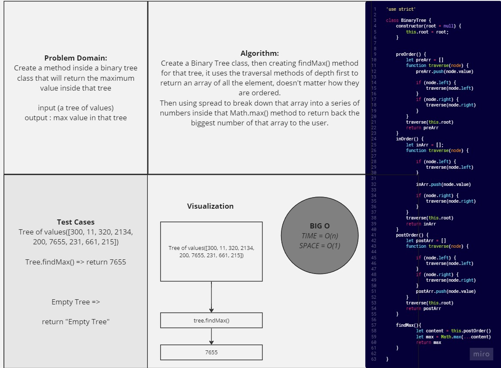

# Tree-MAX

*Create a method inside a binary tree class that will return the maximum value inside that tree using findMax() method.*

## Whiteboard Process



## Solution

``` javascript
'use strict'

class Node {
    constructor(value ,left =null,right =null){
        this.value = value;
        this.left = left;
        this.right = right;
    }
}

class BinaryTree {
    constructor(root = null) {
        this.root = root;
    }


    preOrder() {
        let preArr = []
        function traverse(node) {
            preArr.push(node.value)

            if (node.left) {
                traverse(node.left)
            }
            if (node.right) {
                traverse(node.right)
            }
        }
        traverse(this.root)
        return preArr
    }
    inOrder() {
        let inArr = [];
        function traverse(node) {

            if (node.left) {
                traverse(node.left)
            }

            inArr.push(node.value)

            if (node.right) {
                traverse(node.right)
            }
        }
        traverse(this.root)
        return inArr
    }
    postOrder() {
        let postArr = []
        function traverse(node) {

            if (node.left) {
                traverse(node.left)
            }
            if (node.right) {
                traverse(node.right)
            }
            postArr.push(node.value)
        }
        traverse(this.root)
        return postArr
    }

    findMax(){
            let content = this.postOrder()
            let max = Math.max(...content)
            return max
    }
        
}


```

## For Tests

Navigate to the tree directory and run `npm test -- tree-max.test.js` .
