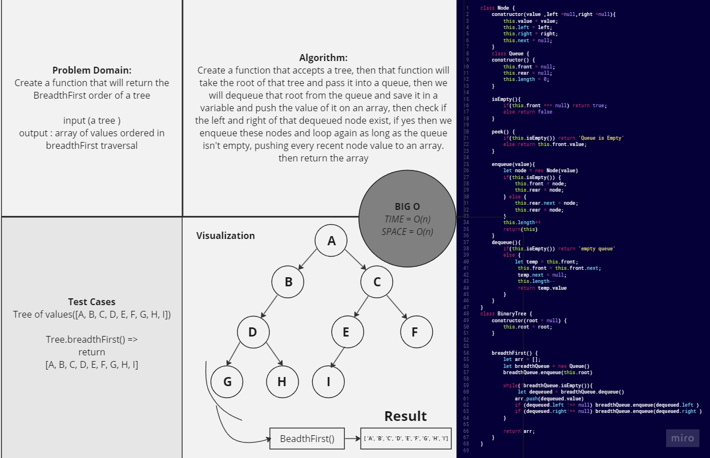

# Breadth-First-Tree

*Create a function that will return the BreadthFirst order of a tree.*

## Whiteboard Process



## Solution

``` javascript
'use strict'

class Node {
    constructor(value ,left =null,right =null){
        this.value = value;
        this.left = left;
        this.right = right;
        this.next = null;
    }
}

class Queue {
    constructor() {
        this.front = null;
        this.rear = null;
        this.length = 0;
    }

    isEmpty(){
        if(this.front === null) return true;
        else return false 
    }

    peek() {
        if(this.isEmpty()) return 'Queue is Empty'
        else return this.front.value;
    }

    enqueue(value){
        let node = new Node(value)
        if(this.isEmpty()) {
            this.front = node;
            this.rear = node;
        } else {
            this.rear.next = node;
            this.rear = node;
        }
        this.length++
        return(this)
    }
    dequeue(){
        if(this.isEmpty()) return 'empty queue'
        else {
            let temp = this.front;
             this.front = this.front.next;
             temp.next = null;
             this.length--
             return temp.value
        }
    }
}
class BinaryTree {
    constructor(root = null) {
        this.root = root;
    }


    preOrder() {
        let preArr = []
        function traverse(node) {
            preArr.push(node.value)

            if (node.left) {
                traverse(node.left)
            }
            if (node.right) {
                traverse(node.right)
            }
        }
        traverse(this.root)
        return preArr
    }
    inOrder() {
        let inArr = [];
        function traverse(node) {

            if (node.left) {
                traverse(node.left)
            }

            inArr.push(node.value)

            if (node.right) {
                traverse(node.right)
            }
        }
        traverse(this.root)
        return inArr
    }
    postOrder() {
        let postArr = []
        function traverse(node) {

            if (node.left) {
                traverse(node.left)
            }
            if (node.right) {
                traverse(node.right)
            }
            postArr.push(node.value)
        }
        traverse(this.root)
        return postArr
    }

    breadthFirst() {
        let arr = [];
        let breadthQueue = new Queue()
        breadthQueue.enqueue(this.root)

        while(!breadthQueue.isEmpty()){
             let dequeued = breadthQueue.dequeue()
            arr.push(dequeued.value)
            if (dequeued.left !== null) breadthQueue.enqueue(dequeued.left )
            if (dequeued.right!== null) breadthQueue.enqueue(dequeued.right )
        }

        return arr;
    }
}


```

## For Tests

Navigate to the tree directory and run `npm test -- tree-breadth-first.test.js` .
