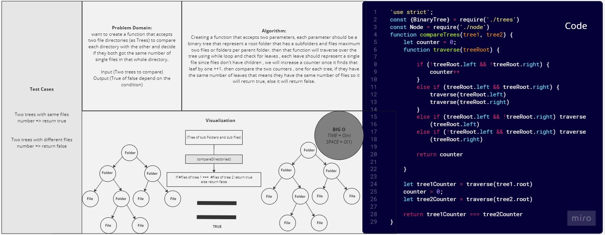

# Breadth-First-Tree

*Creating a function that accepts two parameters, each parameter should be a binary tree that represent a root folder that has a subfolders and files maximum two files or folders per parent folder. then that function will traverse over the tree using while loop and check for leaves , each leave should represent a single file since files don't have children , we will increase a counter once it finds that leaf by one ++1. then compare the two counters , one for each tree, if they have the same number of leaves that means they have the same number of files so it will return true, else it will return false.*

## Whiteboard Process



## Solution

``` javascript
'use strict';
const {BinaryTree} = require('./trees')
const Node = require('./node')
function compareTrees(tree1, tree2) {
    let counter = 0;
    function traverse(treeRoot) {

        if (!treeRoot.left && !treeRoot.right) {
            counter++
        }
        else if (treeRoot.left && treeRoot.right) {
            traverse(treeRoot.left)
            traverse(treeRoot.right)
        }
        else if (treeRoot.left && !treeRoot.right) traverse(treeRoot.left)
        else if (!treeRoot.left && treeRoot.right) traverse(treeRoot.right)

        return counter

    }

    let tree1Counter = traverse(tree1.root)
    counter = 0;
    let tree2Counter = traverse(tree2.root)
   
    return tree1Counter === tree2Counter
}

```

## For Tests

Navigate to the mock-interview-4 directory and modify testing code inside the mock-interview-4.js.
