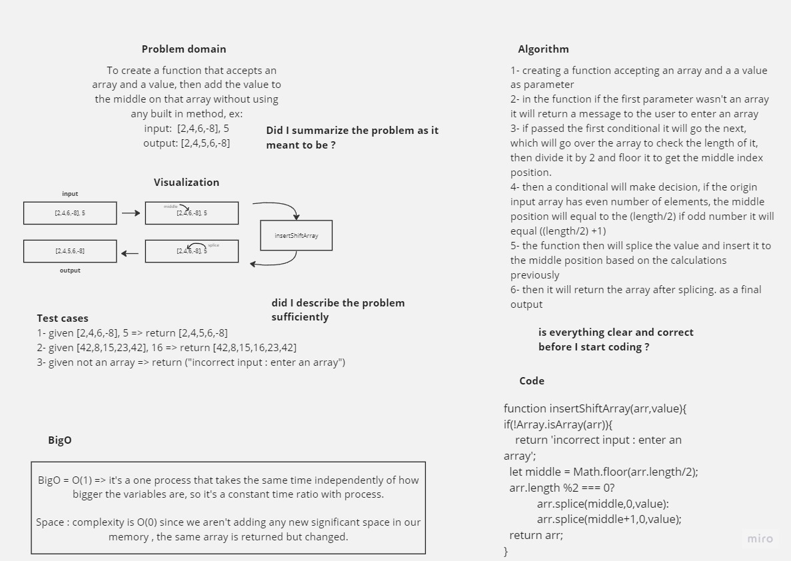

# Array-insert-shift

 To create a function that accepts an array and a value, then add the value to the middle on that array without using any built in method.

## Whiteboard Process



## Solution

``` javascript

'use strict';

function insertShiftArray(arr,value){
  if(!Array.isArray(arr)){
    return 'incorrect input : enter an array';
  }
  else{
    let middle = Math.floor(arr.length/2);
    arr.length %2 === 0?arr.splice(middle,0,value):arr.splice(middle+1,0,value);
    return arr;
  }
}
```
