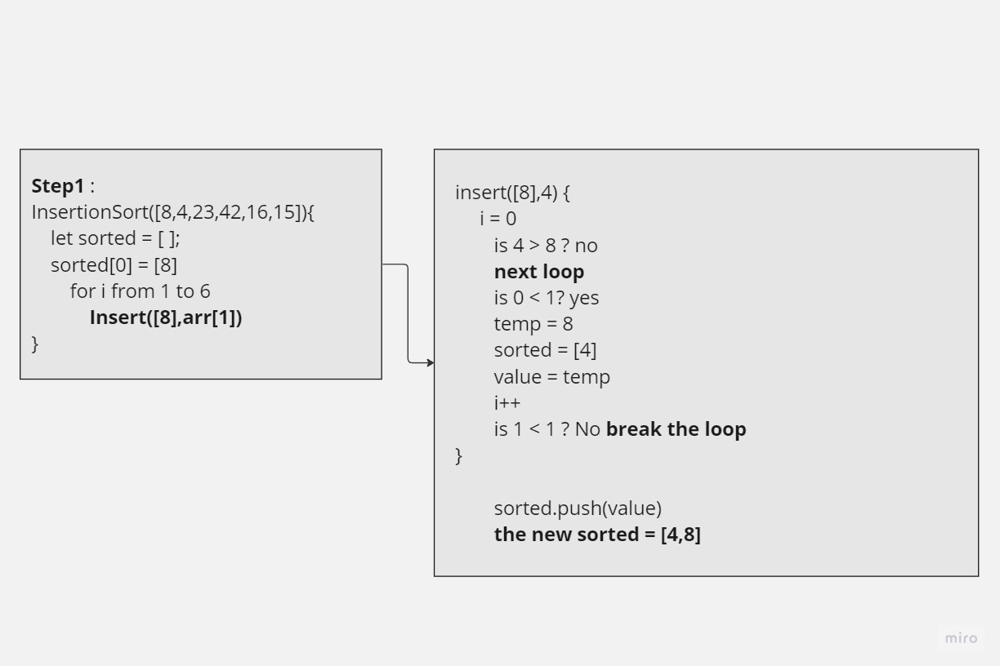
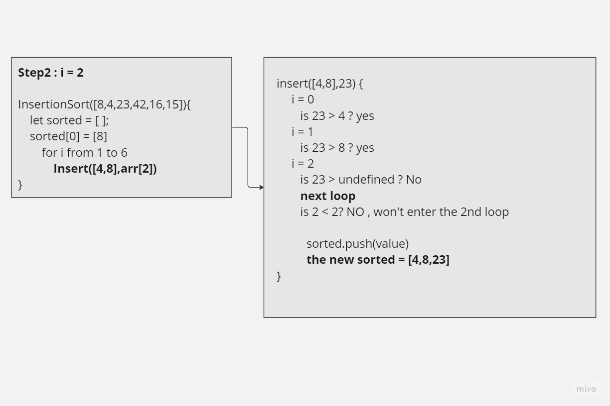
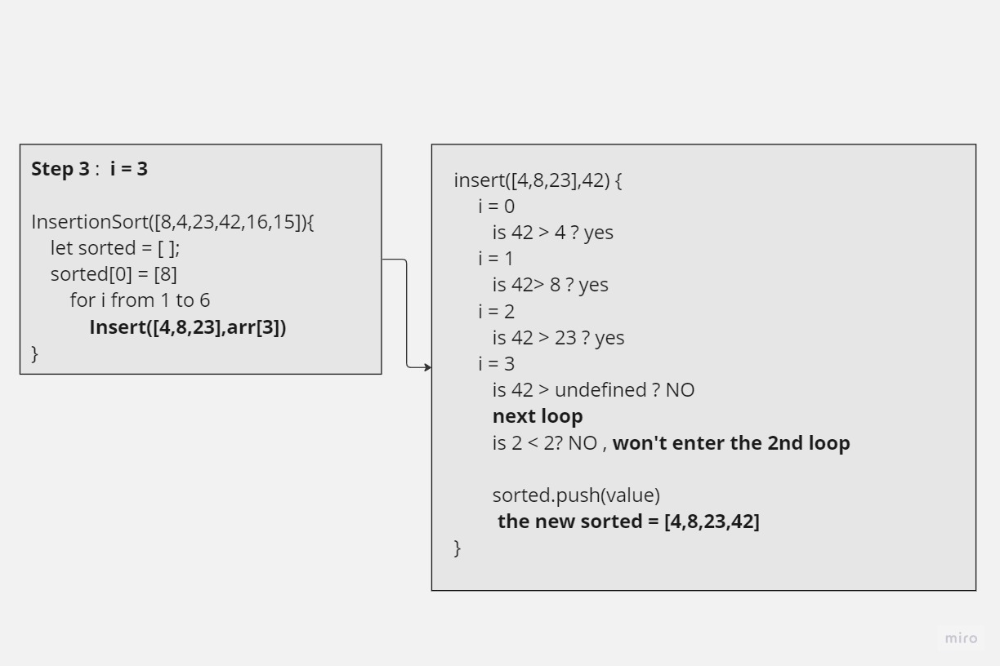
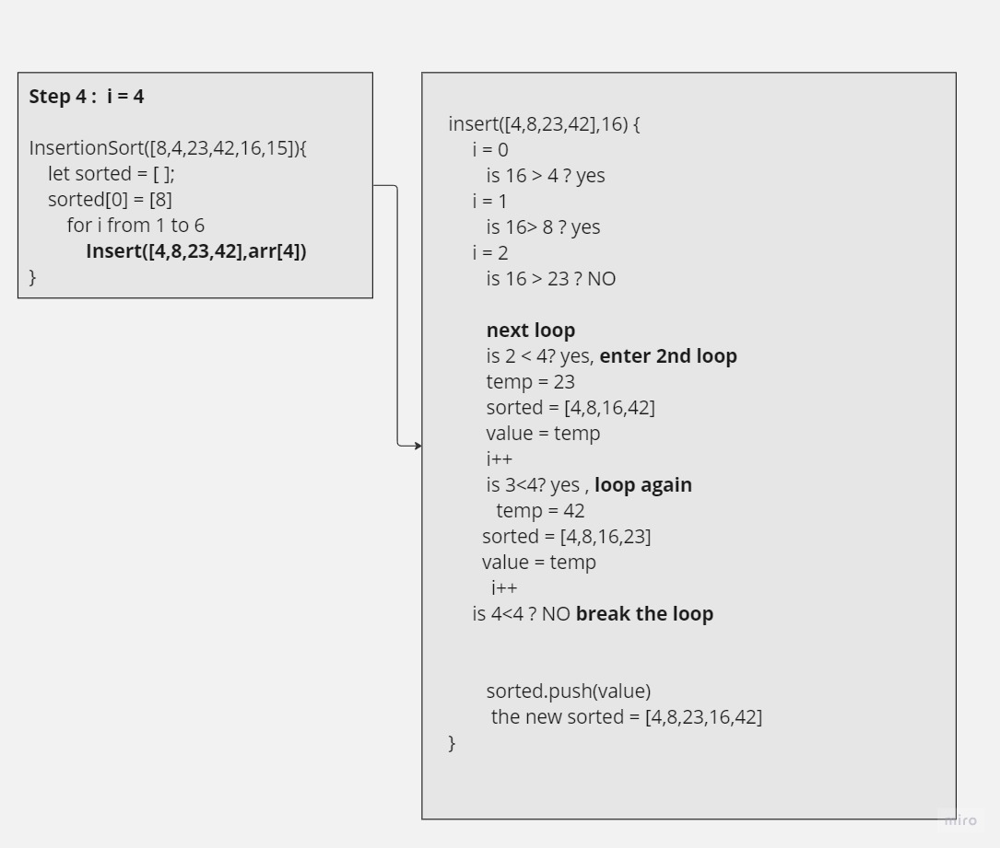
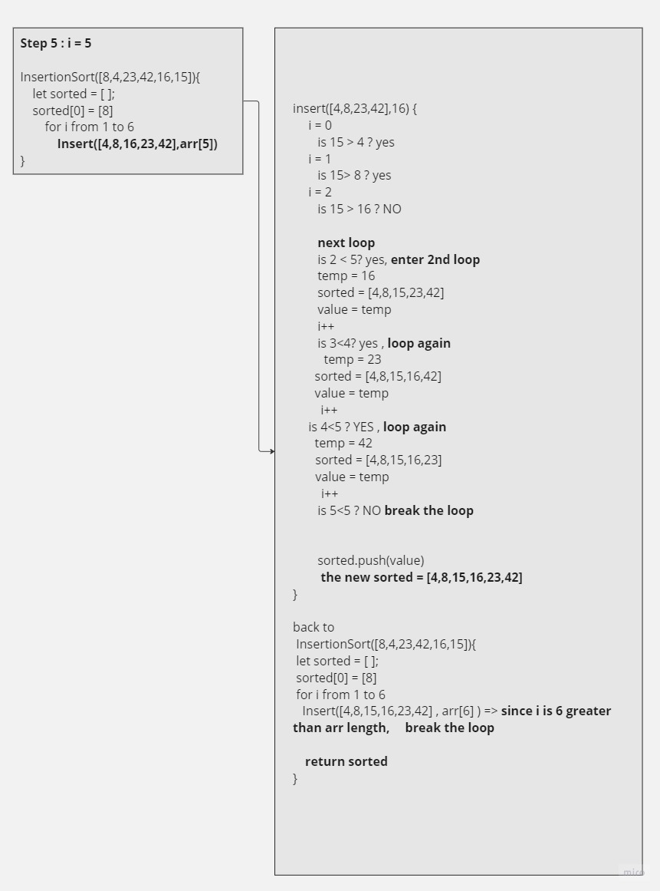

# Insertion-Sort

Insertion sort is a function that accepts an array, and then by inserting the values one by one in order from the input array, it checks and provide a logic where the insertion will be guranteed to be sorted at the end of each iteration so the the end sorted array will always be sorted.

## PseudoCode

``` pseudocode

Insert(int[] sorted, int value)
  initialize i to 0
  WHILE value > sorted[i]
    set i to i + 1
  WHILE i < sorted.length
    set temp to sorted[i]
    set sorted[i] to value
    set value to temp
    set i to i + 1
  append value to sorted

InsertionSort(int[] input)
  LET sorted = New Empty Array
  sorted[0] = input[0]
  FOR i from 1 up to input.length
    Insert(sorted, input[i])
  return sorted

  ```

  Sample array `[8,4,23,42,16,15]`

## Tracing Steps over the pseudoCode







## Efficency

**Time Complexity**:

Since we are executing the Insert function inside a for loop of the InsertionSort function, and Insert function already has 2 while loops, then it's O(2n^2) if we assumed that the array length is 6 as we did above, we are going to loop 6 times in the for loop, and inside each loop we will do two while loops, so  the ratio is almost like for each 6 loops of For we do the double of while loop, so (6:12)

Now for a length of 5, then it's 5:10 ratio, as you can see now the jumps are always 2 whatever was the length, so the constant 2 which is the increment in executing the while loops for each new for loop added, will be dicarded, because relatively to n^2, it isn't effiecient to count.

**Time O(n^2).**

**Space Complexity**:

Since we are creating a new array in our function that is sorted from the input array, the complexity will be dependant on that array size, because we are adding a similar space to the memeory by creating the new sorted array.

**Space O(n).**

---

## For Testing

Navigate to the challenge directory then type `npm test -- Insertion-Sort.test.js`
