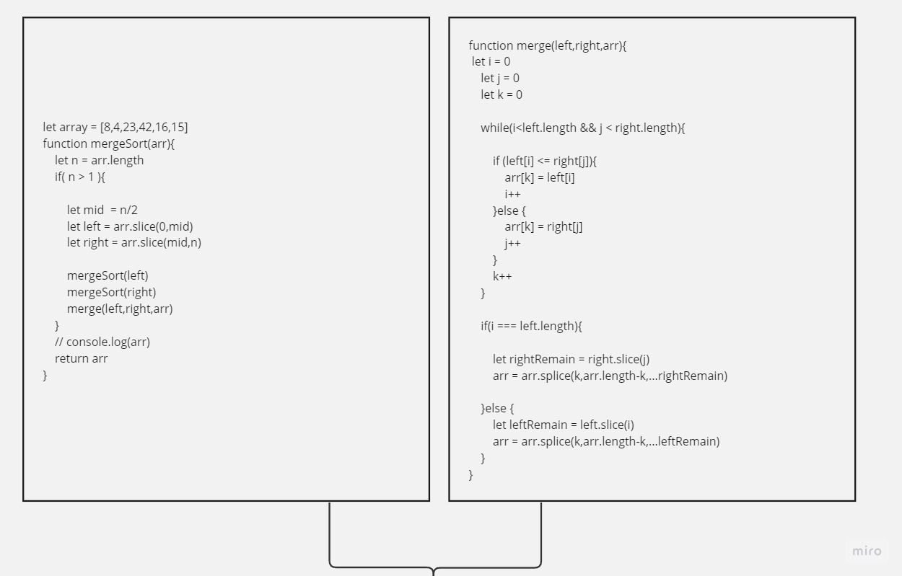
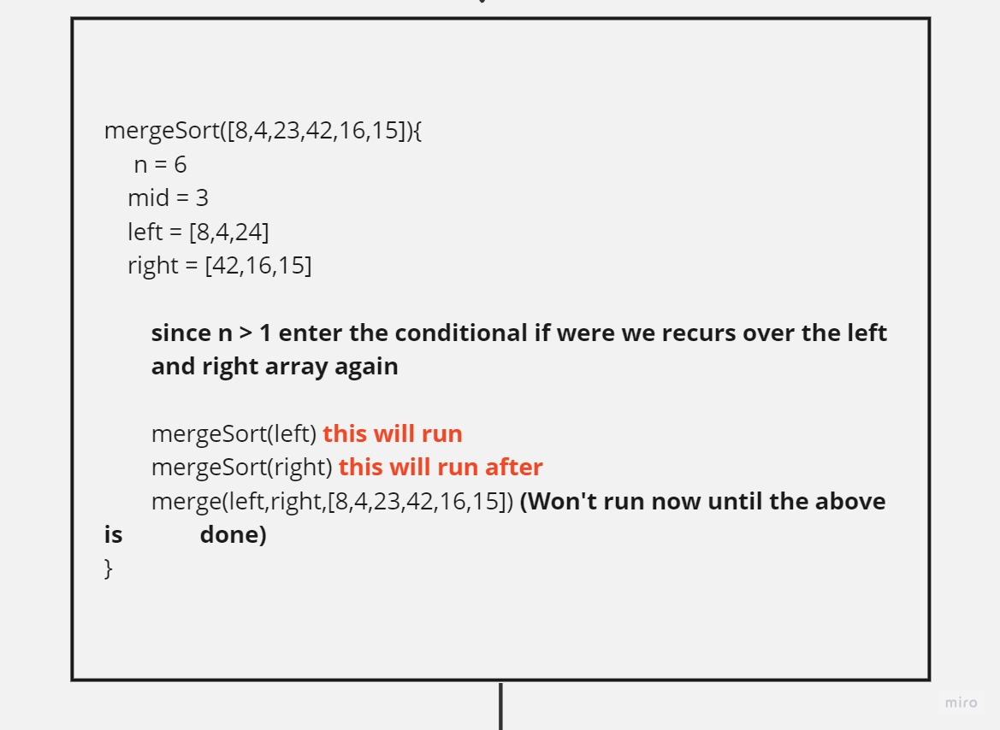
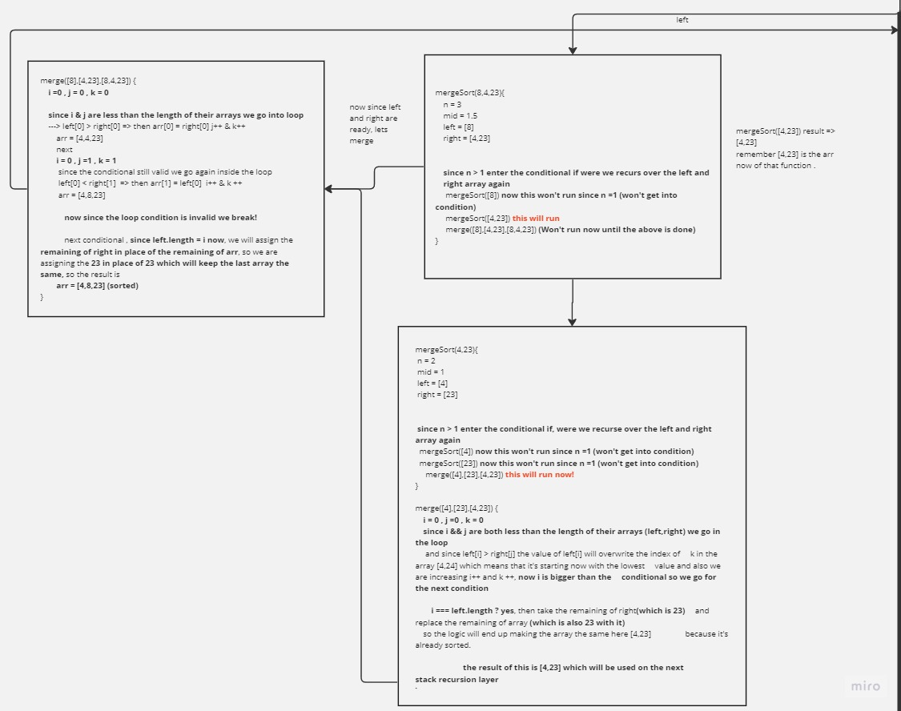
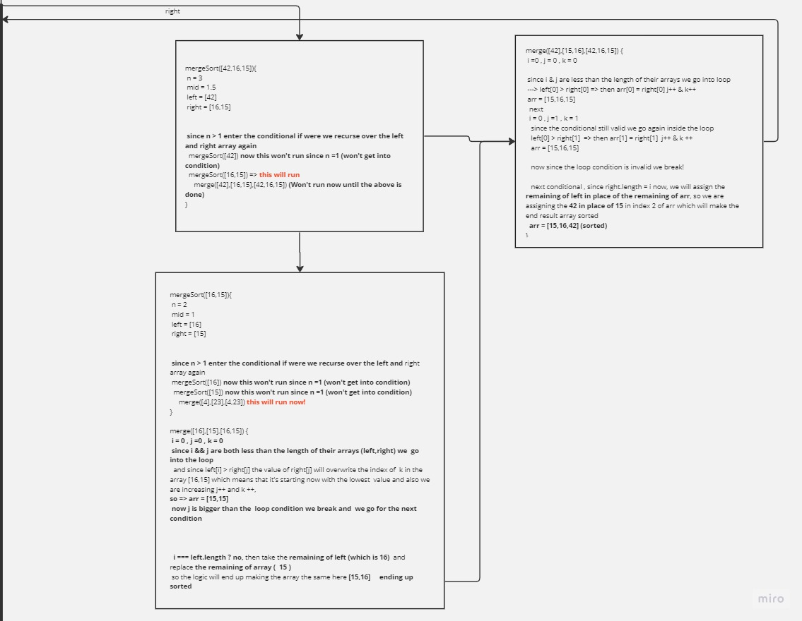
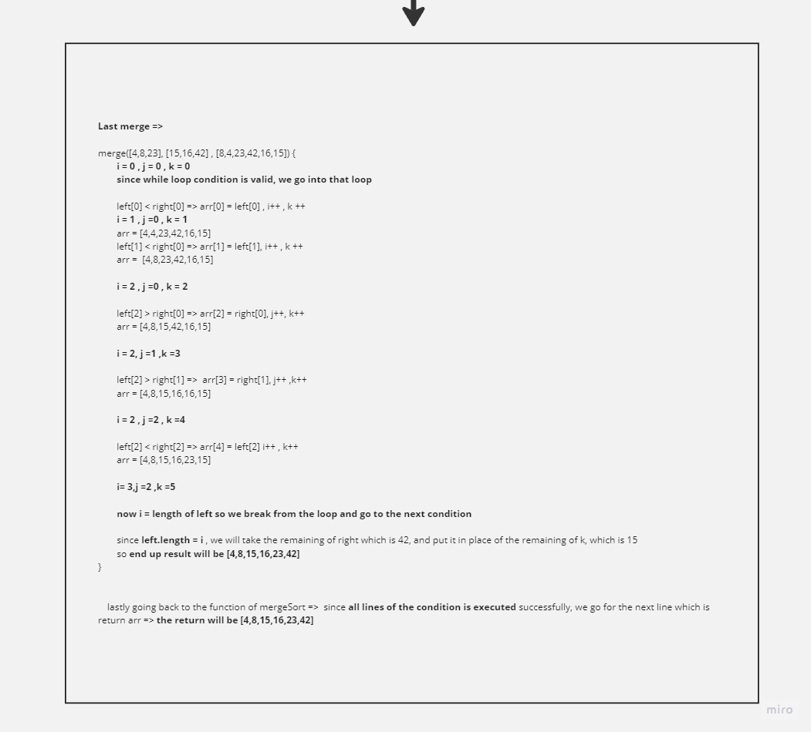

# Merge-sort

This is a function , where it splits an array to smaller pieces then sort the array down in a recursive function, then after the last recursion is done, it start building up the hierarchy of the mother array with the end result of a sorted full array version of the input array.

## PseudoCode

``` pseudocode

ALGORITHM Mergesort(arr)
    DECLARE n <-- arr.length

    if n > 1
      DECLARE mid <-- n/2
      DECLARE left <-- arr[0...mid]
      DECLARE right <-- arr[mid...n]
      // sort the left side
      Mergesort(left)
      // sort the right side
      Mergesort(right)
      // merge the sorted left and right sides together
      Merge(left, right, arr)

ALGORITHM Merge(left, right, arr)
    DECLARE i <-- 0
    DECLARE j <-- 0
    DECLARE k <-- 0

    while i < left.length && j < right.length
        if left[i] <= right[j]
            arr[k] <-- left[i]
            i <-- i + 1
        else
            arr[k] <-- right[j]
            j <-- j + 1

        k <-- k + 1

    if i = left.length
       set remaining entries in arr to remaining values in right
    else
       set remaining entries in arr to remaining values in left

  ```

  Sample array `[8,4,23,42,16,15]`

## Miro Step Through

[Tracing Miro Link](https://miro.com/app/board/uXjVMsfMSyo=/?share_link_id=704604931452)

## Tracing Steps over the pseudoCode

Step 1: Both functions



Step 2: Starting with the parent recursion


Step 3: left side recursive functions of the tree of recursion


Step 4: right side recursive functions of the tree of recursion


Step 5: the parent recursion after all child recursions are done.


## Efficency

**Time Complexity**:

Since we are exectuing two functions, One is recursive function repeating itself, and the other function is a loop that happens at the end of each recursion, we would consider each function time complexity in the stack going less and less as the parent array get divided into halves each time, Meaning that the while loop will get shorter and shorter each time a new recursive function adds to the stack, and since the while loop is depending on the current array length which illustrate a logarithimic relation, so the time complexity of the whole function is 
O(nlog(n)) where the constant n before the log, represents the while loop complexity adding to the recursive log(n) which is getting faster to the end with each split happens to the parent array.(The basic principle here, that with each recursion, the time for each process gets lower).

**Time O( nlog(n) ).**

**Space Complexity**:

Since we are creating a new array in our function that is sorted from the input array, the complexity will be dependant on that array size (creating virtual space depending on the parent array size), because we are adding a similar space to the memeory by creating the new sorted array.

**Space O(n).**

---

## The CODE

``` javascript

    'use strict'

let array = [8,4,23,42,16,15]
function mergeSort(arr){
    let n = arr.length

    if( n > 1 ){

        let mid  = n/2
        let left = arr.slice(0,mid)
        let right = arr.slice(mid,n)

        mergeSort(left)
        mergeSort(right)
        merge(left,right,arr)
    }
    // console.log(arr)
    return arr
}

function merge(left,right,arr){
    let i = 0
    let j = 0
    let k = 0

    while(i<left.length && j < right.length){

        if (left[i] <= right[j]){
            arr[k] = left[i]
            i++
        }else {
            arr[k] = right[j]
            j++
        }
        k++
    }

    if(i === left.length){

        let rightRemain = right.slice(j)
        arr = arr.splice(k,arr.length-k,...rightRemain)

    }else {
        let leftRemain = left.slice(i)
        arr = arr.splice(k,arr.length-k,...leftRemain)
    }
}

console.log(mergeSort(array))

```

## For Testing

Navigate to the challenge directory then type `npm test -- merge-sort.test.js`
