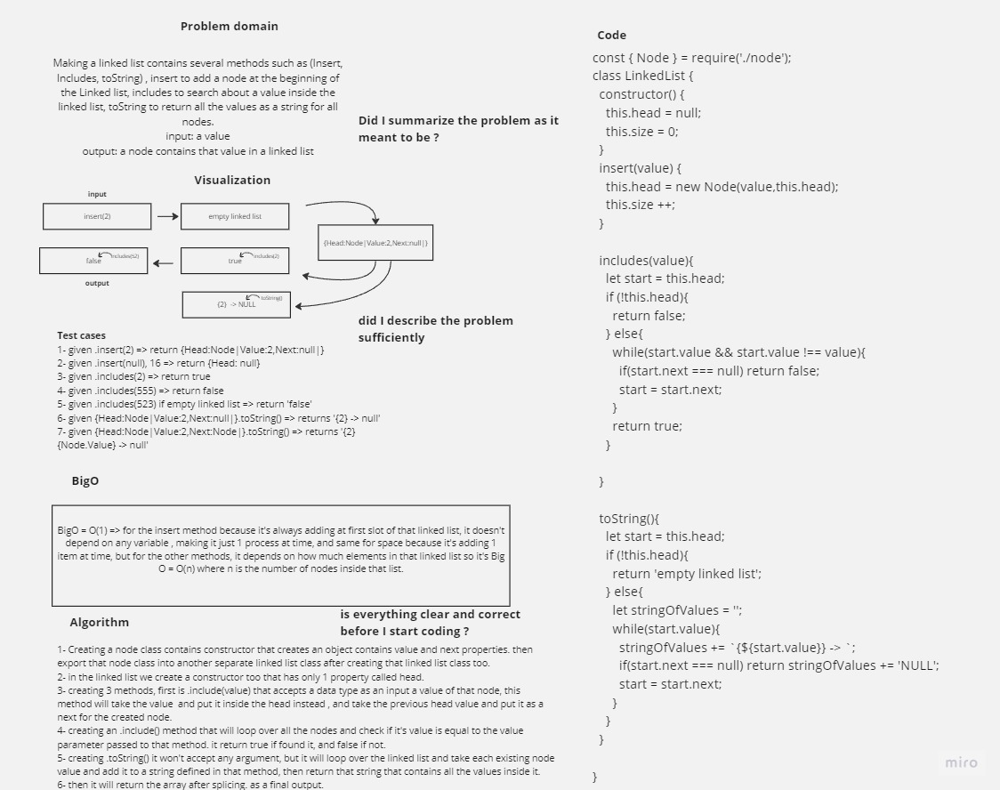

# Challenge Title

Making a linked list contains several methods such as (Insert, Includes, toString) , insert to add a node at the beginning of the Linked list, includes to search about a value inside the linked list, toString to return all the values as a string for all nodes.

## Whiteboard Process



## Solution

``` javascript
const { Node } = require('./node');

class LinkedList {
  constructor() {
    this.head = null;
    this.size = 0;
  }
  insert(value) {
    this.head = new Node(value,this.head);
    this.size ++;
    
  }

  includes(value){
    let start = this.head;
    if (!this.head){
      return false;
    } else{
      while(start.value && start.value !== value){
        if(start.next === null) return false;
        start = start.next;
      }
      return true;
    }

  }

  toString(){
    let start = this.head;
    if (!this.head){
      return 'empty linked list';
    } else{
      let stringOfValues = '';
      while(start.value){
        stringOfValues += `{${start.value}} -> `;
        if(start.next === null) return stringOfValues += 'NULL';
        start = start.next;
      }
    }
  }
}

```
