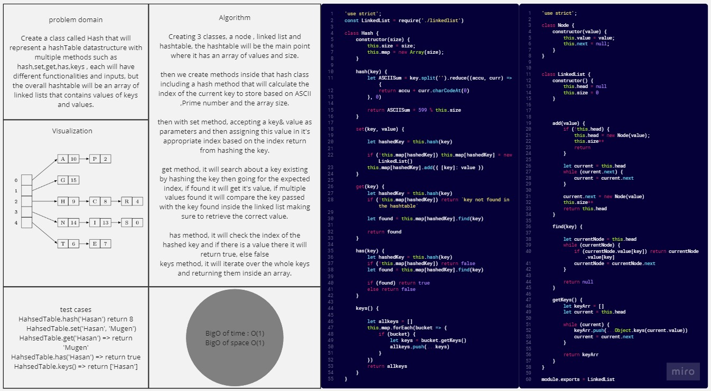

# HashTables

*Create a class called Hash that will represent a hashTable datastructure with multiple methods such as hash,set,get,has,keys , each will have different functionalities and inputs, but the overall hashtable will be an array of linked lists that contains values of keys and values.*

## Whiteboard Process



## Solution

``` javascript
'use strict';

class Node {
    constructor(value) {
        this.value = value;
        this.next = null;
    }
}


class LinkedList {
    constructor() {
        this.head = null
        this.size = 0
    }


    add(value) {
        if (!this.head) {
            this.head = new Node(value);
            this.size++
            return
        }

        let current = this.head
        while (current.next) {
            current = current.next
        }

        current.next = new Node(value)
        this.size++
        return this.head
    }

    find(key) {

        let currentNode = this.head
        while (currentNode) {
            if (currentNode.value[key]) return currentNode.value[key]
            currentNode = currentNode.next
        }

        return null
    }

    getKeys() {
        let keyArr = []
        let current = this.head

        while (current) {
            keyArr.push(...Object.keys(current.value))
            current = current.next
        }

        return keyArr
    }
}

class Hash {
    constructor(size) {
        this.size = size;
        this.map = new Array(size);
    }

    hash(key) {
        let ASCIISum = key.split('').reduce((accu, curr) => {
            return accu + curr.charCodeAt(0)
        }, 0)

        return ASCIISum * 599 % this.size
    }

    set(key, value) {

        let hashedKey = this.hash(key)

        if (!this.map[hashedKey]) this.map[hashedKey] = new LinkedList()
        this.map[hashedKey].add({ [key]: value })
    }

    get(key) {
        let hashedKey = this.hash(key)
        if (!this.map[hashedKey]) return `key not found in the hashtable`

        let found = this.map[hashedKey].find(key)

        return found
    }

    has(key) {
        let hashedKey = this.hash(key)
        if (!this.map[hashedKey]) return false
        let found = this.map[hashedKey].find(key)

        if (found) return true
        else return false
    }

    keys() {

        let allkeys = []
        this.map.forEach(bucket => {
            if (bucket) {
                let keys = bucket.getKeys()
                allkeys.push(...keys)
            }
        })
        return allkeys
    }
}


let HahsedTable = new Hash(19)


```

## For Tests

Navigate to the tree directory and run `npm test -- hash.test.js` .
