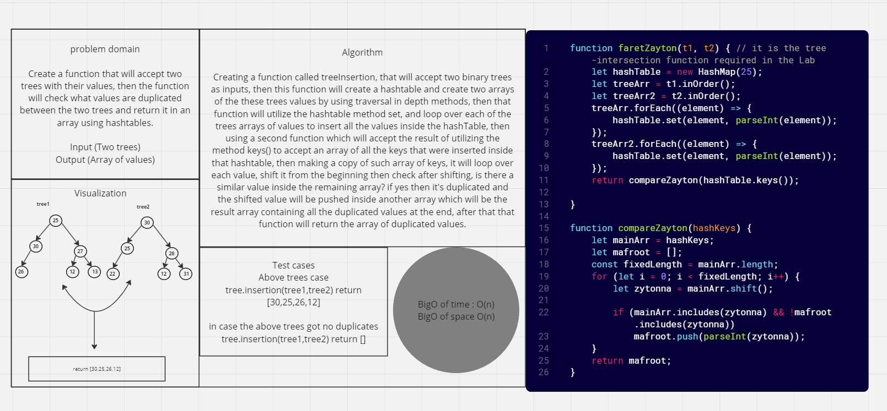

# HashTables-tree-intersections

Note: Worked with laith on this challange

## Problem Domain

*Create a function that will accept two trees with their values, then the function will check what values are duplicated between the two trees and return it in an array using hashtables.*

*Input (Two trees)
Output (Array of values)*

## Whiteboard Process



## Solution

``` javascript
function faretZayton(t1, t2) { // it is the tree-intersection function required in the Lab
    let hashTable = new HashMap(25);
    let treeArr = t1.inOrder();
    let treeArr2 = t2.inOrder();
    treeArr.forEach((element) => {
        hashTable.set(element, parseInt(element));
    });
    treeArr2.forEach((element) => {
        hashTable.set(element, parseInt(element));
    });
    return compareZayton(hashTable.keys());
}

function compareZayton(hashKeys) {
    let mainArr = hashKeys;
    let mafroot = [];
    const fixedLength = mainArr.length;
    for (let i = 0; i < fixedLength; i++) {
        let zytonna = mainArr.shift();

        if (mainArr.includes(zytonna) && !mafroot.includes(zytonna))
            mafroot.push(parseInt(zytonna));
    }
    return mafroot;
}


```

## For Tests

Navigate to the tree directory and run `npm test -- tree-intersections.test.js` .
