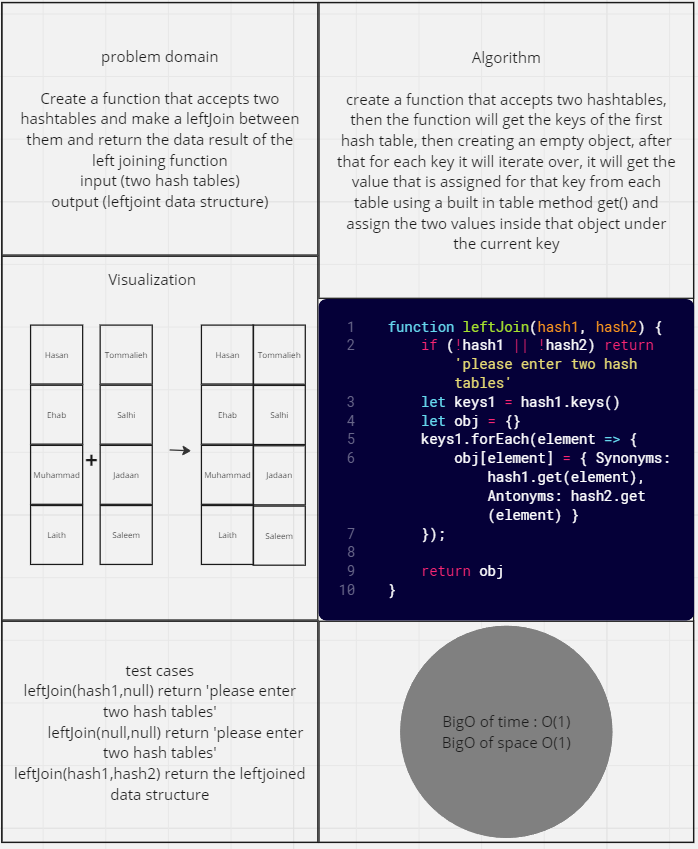

# HashTables-leftJoin

*Create a function that accepts two hashtables and make a leftJoin between them and return the data result of the left joining function.*

## Whiteboard Process



## Solution

``` javascript
'use strict'

const Hash = require('../code-challenge-30-hashtables/hash')


function leftJoin(hash1, hash2) {
    if (!hash1 || !hash2) return 'please enter two hash tables'
    let keys1 = hash1.keys()
    let obj = {}
    keys1.forEach(element => {
        obj[element] = { Synonyms: hash1.get(element), Antonyms: hash2.get(element) }
    });

    return obj
}

```

## For Tests

Navigate to the tree directory and run `npm test -- left-join.test.js` .
