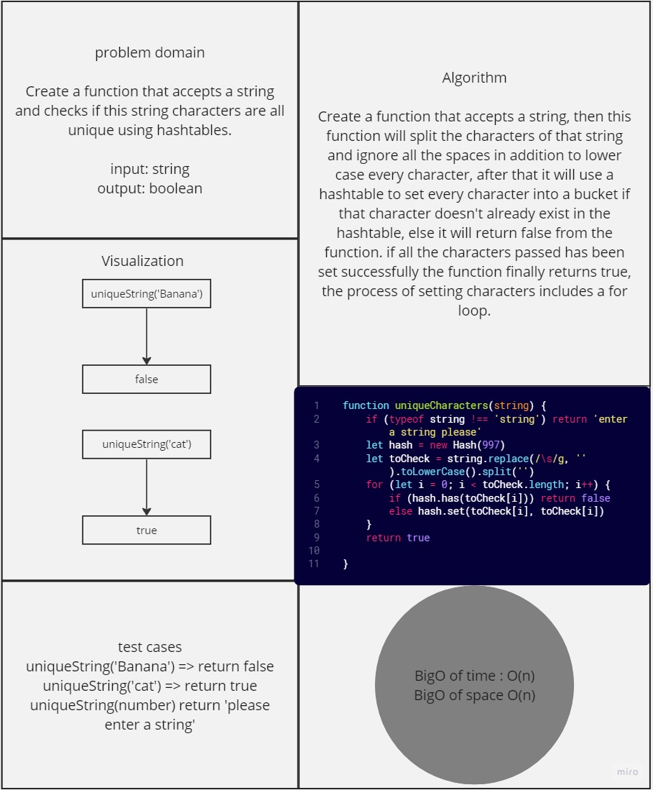

# Mock-interview-6

*Create a function that accepts a string and checks if this string characters are all unique using hashtables.*

## Whiteboard Process



## Solution

``` javascript
'use strict';
const Hash = require('../../code-challenge-30-hashtables/hash')

function uniqueCharacters(string) {
    if (typeof string !== 'string') return 'enter a string please'
    let hash = new Hash(997)
    let toCheck = string.replace(/\s/g, '').toLowerCase().split('')
    for (let i = 0; i < toCheck.length; i++) {
        if (hash.has(toCheck[i])) return false
        else hash.set(toCheck[i], toCheck[i])
    }
    return true

}


```

## For Tests

Navigate to the tree directory and run `npm test -- unique-characters.test.js` .
