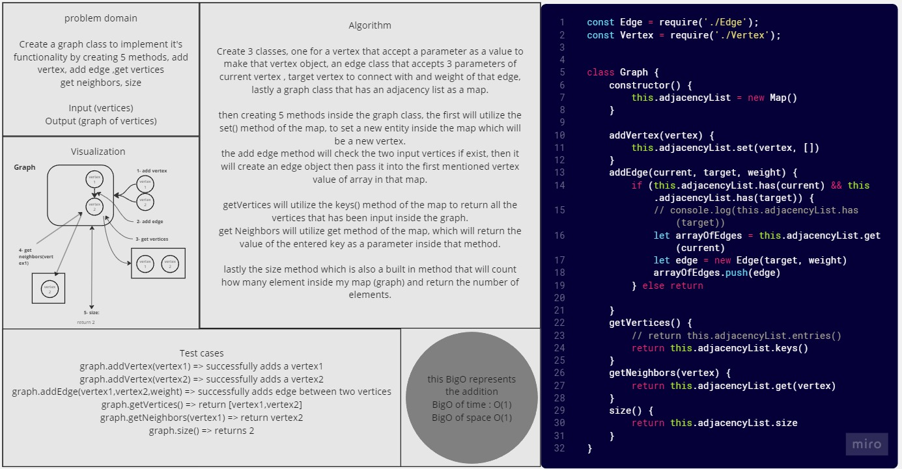

# Graphs

## Problem Domain

*Create a graph class to implement it's functionality by creating 5 methods, add vertex, add edge ,get vertices
get neighbors and size.*

*Input (vertices)
Output (graph of vertices)*

## Whiteboard Process



## Solution

``` javascript
class Graph {
    constructor() {
        this.adjacencyList = new Map()
    }

    addVertex(vertex) {
        this.adjacencyList.set(vertex, [])
    }
    addEdge(current, target, weight) {
        if (this.adjacencyList.has(current) && this.adjacencyList.has(target)) {

            let arrayOfEdges = this.adjacencyList.get(current)
            let edge = new Edge(target, weight)
            arrayOfEdges.push(edge)
        } else return

    }
    getVertices() {
        return this.adjacencyList.keys()
    }
    getNeighbors(vertex) {
        return this.adjacencyList.get(vertex)
    }
    size() {
        return this.adjacencyList.size
    }
}


```

## For Tests

Navigate to the tree directory and run `npm test -- Graphs.test.js` .
