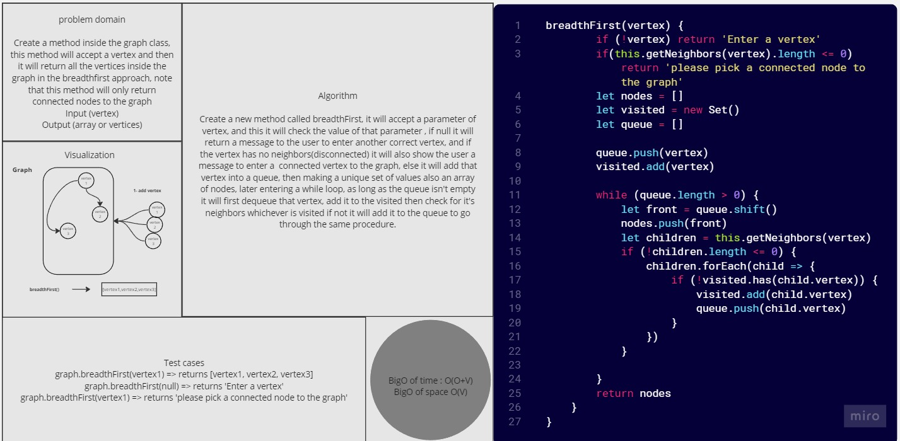

# Graphs-BreadthFirst

*Create a method inside the graph class, this method will accept a vertex and then it will return all the vertices inside the graph in the breadthfirst approach, note that this method will only return connected nodes to the graph.*

## Whiteboard Process



## Solution

``` javascript
'use strict'

breadthFirst(vertex) {
        if (!vertex) return 'Enter a vertex'
        if(this.getNeighbors(vertex).length <= 0) return 'please pick a connected node to the graph'
        let nodes = []
        let visited = new Set()
        let queue = []

        queue.push(vertex)
        visited.add(vertex)

        while (queue.length > 0) {
            let front = queue.shift()
            nodes.push(front)
            let children = this.getNeighbors(vertex)
            if (!children.length <= 0) {
                children.forEach(child => {
                    if (!visited.has(child.vertex)) {
                        visited.add(child.vertex)
                        queue.push(child.vertex)
                    }
                })
            }

        }
        return nodes
    }

```

## For Tests

Navigate to the tree directory and run `npm test -- graph-breadth-first.test.js` .
