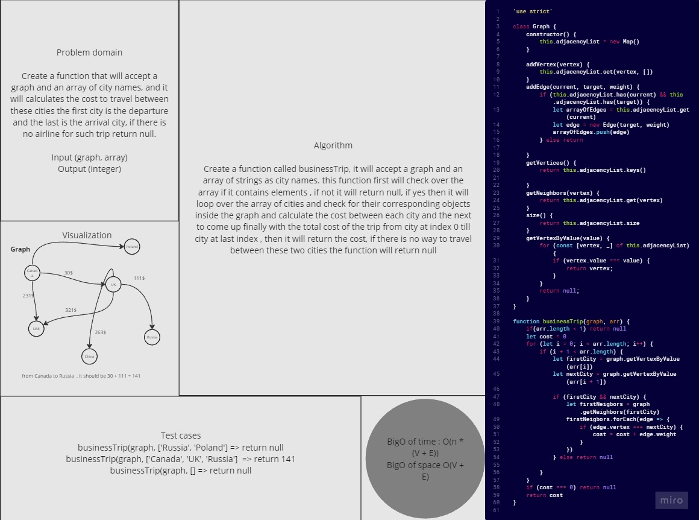

# Graphs-Business-Trip

*Create a function that will accept a graph and an array of city names, and it will calculates the cost to travel between these cities the first city is the departure and the last is the arrival city, if there is no airline for such trip return null.*

## Whiteboard Process



## Solution

``` javascript
'use strict'

class Graph {
    constructor() {
        this.adjacencyList = new Map()
    }

    addVertex(vertex) {
        this.adjacencyList.set(vertex, [])
    }
    addEdge(current, target, weight) {
        if (this.adjacencyList.has(current) && this.adjacencyList.has(target)) {
            let arrayOfEdges = this.adjacencyList.get(current)
            let edge = new Edge(target, weight)
            arrayOfEdges.push(edge)
        } else return

    }
    getVertices() {
        return this.adjacencyList.keys()

    }
    getNeighbors(vertex) {
        return this.adjacencyList.get(vertex)
    }
    size() {
        return this.adjacencyList.size
    }
    getVertexByValue(value) {
        for (const [vertex, _] of this.adjacencyList) {
            if (vertex.value === value) {
                return vertex;
            }
        }
        return null; 
    }
}

function businessTrip(graph, arr) {
    if(arr.length < 1) return null
    let cost = 0
    for (let i = 0; i < arr.length; i++) {
        if (i + 1 < arr.length) {
            let firstCity = graph.getVertexByValue(arr[i])
            let nextCity = graph.getVertexByValue(arr[i + 1])

            if (firstCity && nextCity) {
                let firstNeigbors = graph.getNeighbors(firstCity)
                firstNeigbors.forEach(edge => {
                    if (edge.vertex === nextCity) {
                        cost = cost + edge.weight
                    }
                })
            } else return null

        }
    }
    if (cost === 0) return null
    return cost
}

```

## For Tests

Navigate to the tree directory and run `npm test -- graph-business-trip.test.js` .
