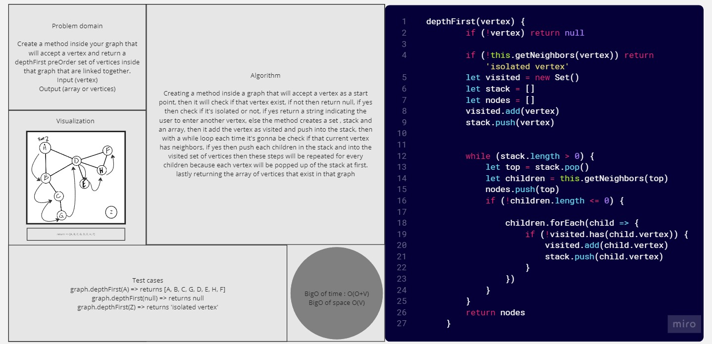

# Graphs-depthFirst

*Create a method inside your graph that will accept a vertex and return a depthFirst preOrder set of vertices inside that graph that are linked together.*

## Whiteboard Process



## Solution

``` javascript
'use strict'

depthFirst(vertex) {
        if (!vertex) return null

        if (!this.getNeighbors(vertex)) return 'isolated vertex'
        let visited = new Set()
        let stack = []
        let nodes = []
        visited.add(vertex)
        stack.push(vertex)

        while (stack.length > 0) {
            let top = stack.pop()
            let children = this.getNeighbors(top)
            nodes.push(top)
            if (!children.length <= 0) {

                children.forEach(child => {
                    if (!visited.has(child.vertex)) {
                        visited.add(child.vertex)
                        stack.push(child.vertex)
                    }
                })
            }
        }
        return nodes
    }


```

## For Tests

Navigate to the tree directory and run `npm test -- graph-depth-first.test.js` .
