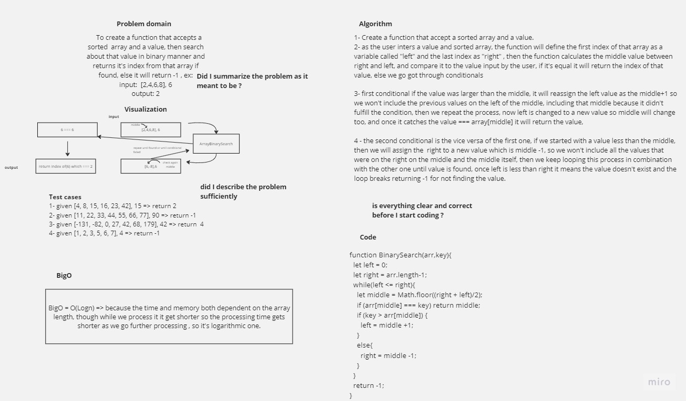

# Array-Binary-Search

 To create a function that accepts a sorted  array and a value, then search about that value in binary manner and returns it's index from that array if found, else it will return -1.

## Whiteboard Process



## Solution

``` javascript

'use strict';
function BinarySearch(arr,key){
  let left = 0;
  let right = arr.length-1;

  while(left <= right){
    let middle = Math.floor((right + left)/2);
    if (arr[middle] === key) return middle;
    if (key > arr[middle]) {
      left = middle +1;
    }
    else{
      right = middle -1;
    }
  }
  return -1;
}
```
