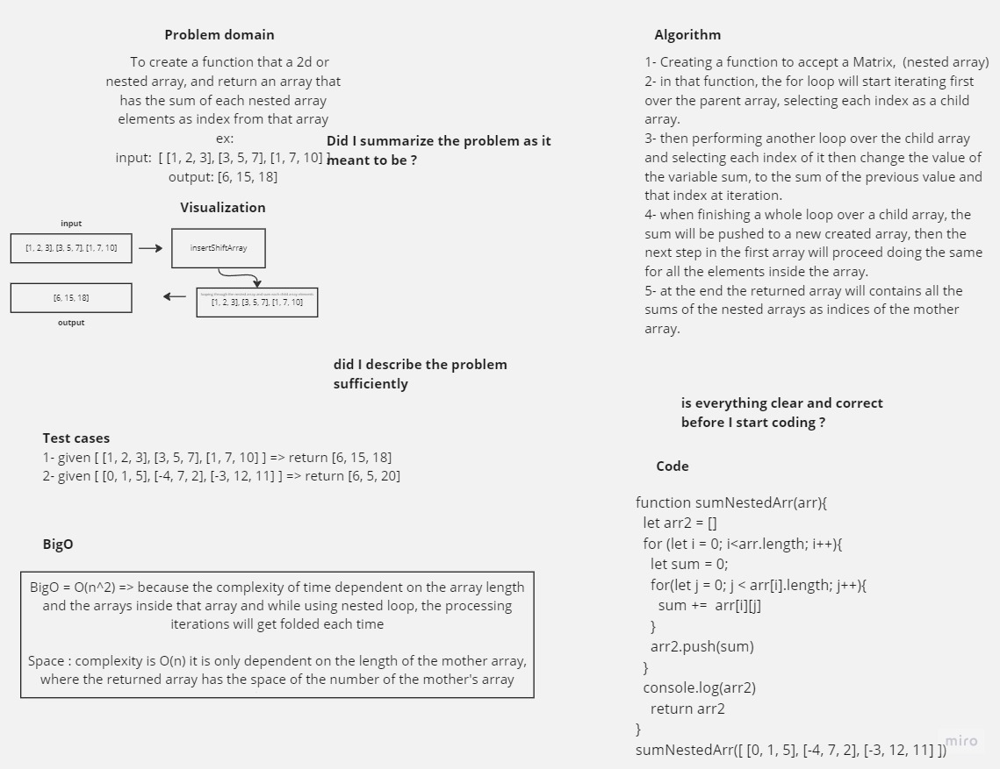

# Mock - Interview

 To create a function that a 2d or nested array, and return an array that has the sum of each nested array elements as index from that array.

## Whiteboard Process



## Solution

``` javascript

'use strict';
function sumNestedArr(arr){
  let arr2 = []
  for (let i = 0; i<arr.length; i++){
    let sum = 0;
    for(let j = 0; j < arr[i].length; j++){
      sum +=  arr[i][j]
    }
    arr2.push(sum)
  }
  console.log(arr2)
    return arr2
}
sumNestedArr([ [0, 1, 5], [-4, 7, 2], [-3, 12, 11] ])
```
