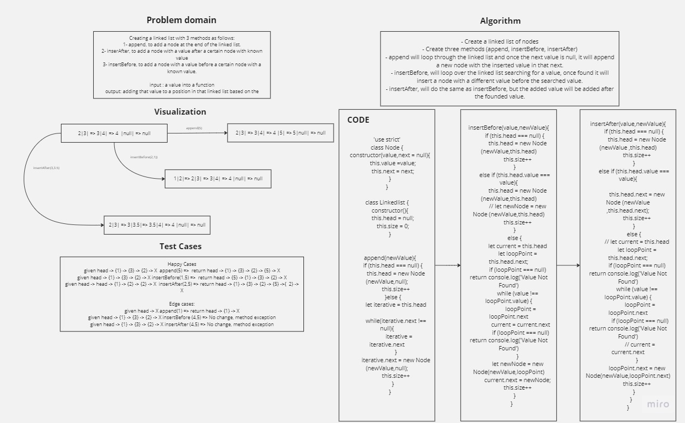

# Linked Lists Insertions

Creating a linked list with 3 methods as follows:

- append, to add a node at the end of the linked list.

- inserAfter, to add a node with a value after a certain node with known value.

- insertBefore, to add a node with a value before a certain node with a known value.

Input: a value into a function.

Output: adding that value to a position in that linked list based on the method used.

## Whiteboard Process



## Solution

``` javascript
'use strict'

class Node {
    constructor(value,next = null){
        this.value =value;
        this.next = next;
    }
}

class Linkedlist {
    constructor(){
        this.head = null;
        this.size = 0;
    }
    

    append(newValue){
        if (this.head === null) {
            this.head = new Node (newValue,null);
            this.size++
        }else {
            let iterative = this.head
    
            while(iterative.next !== null){
                iterative = iterative.next
            }
            iterative.next = new Node (newValue,null);
            this.size++
        }
    }

    insertBefore(value,newValue){
        if (this.head === null) {
            this.head = new Node (newValue,this.head)
            this.size++
        }
        else if (this.head.value === value){
            this.head = new Node (newValue,this.head)
            // let newNode = new Node (newValue,this.head)
            this.size++
        }
        else {
            let current = this.head
            let loopPoint = this.head.next;
            if (loopPoint === null) return console.log('Value Not Found')
            while (value !== loopPoint.value) {
                loopPoint = loopPoint.next
                current = current.next
                if (loopPoint === null) return console.log('Value Not Found')
            }
            let newNode = new Node(newValue,loopPoint)
            current.next = newNode;
            this.size++
        }
    }
    insertAfter(value,newValue){
        if (this.head === null) {
            this.head = new Node (newValue ,this.head)
            this.size++
        }
        else if (this.head.value === value){
             
            this.head.next = new Node (newValue ,this.head.next);
            this.size++
        }
        else {
            // let current = this.head
            let loopPoint = this.head.next;
            if (loopPoint === null) return console.log('Value Not Found')
            while (value !== loopPoint.value) {
                loopPoint = loopPoint.next
                if (loopPoint === null) return console.log('Value Not Found')
                // current = current.next
            }
            loopPoint.next = new Node(newValue,loopPoint.next)
            this.size++
        }
    }
}

```
