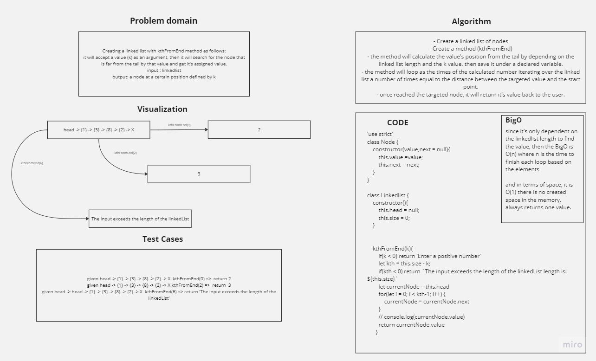

# Linked Lists Kth From End

Creating a linked list with kthFromEnd method as follows:

It will accept a value (k) as an argument, then it will search for the node that is far from the tail by that value and get it's assigned value.

Input : linkedlist

Output: a node at a certain position defined by k

## Whiteboard Process



## Solution

``` javascript
'use strict'
class Node {
    constructor(value,next = null){
        this.value =value;
        this.next = next;
    }
}

class Linkedlist {
    constructor(){
        this.head = null;
        this.size = 0;
    }


    kthFromEnd(k){
        if(k < 0) return 'Enter a positive number'
        let kth = this.size - k;
        if(kth < 0) return `The input exceeds the length of the linkedList length is: ${this.size}`
        let currentNode = this.head
        for(let i = 0; i < kth-1; i++) {
            currentNode = currentNode.next
        }
        // console.log(currentNode.value)
        return currentNode.value
      }
}

```


## For Tests

run npm test after navigating to the directory of this file.
